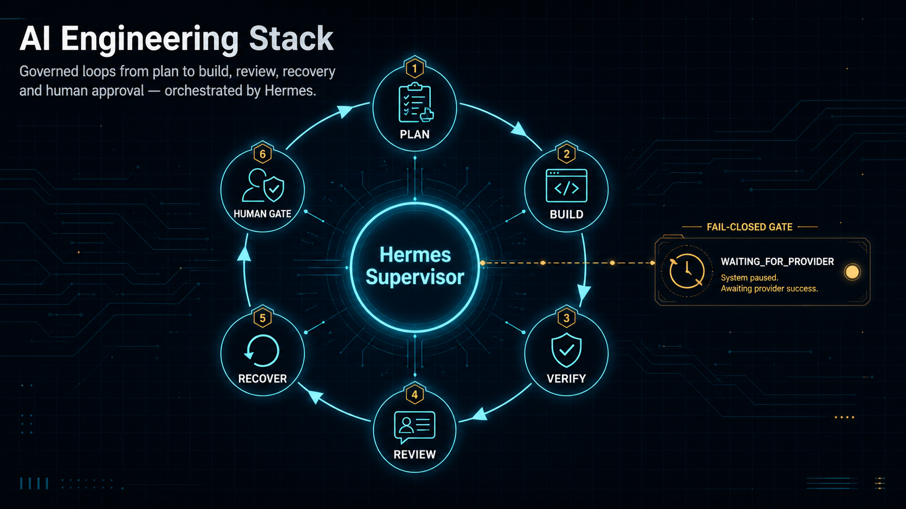

# Ömer Hüseyin Coskun — AI-Engineering-Stack

[English](README.md) · [Architektur](docs/ARCHITECTURE.md) · [Skills](docs/SKILLS.md) · [Kompetenzen](docs/CAPABILITIES.md) · [Setup](docs/SETUP.md) · [Öffentliche Quellen](docs/SOURCES.md)



> **Ausgelegt für vollautonome Orchestrierung mit sicheren Handyfreigaben.**

## 👋 Über mich

Ich bin **Ömer Hüseyin Coskun**, AI Engineer mit Fokus auf verlässliche Agentensysteme.
Ich forme Modelle zu einer Engineering Workforce, die planen, bauen, verifizieren,
unabhängig prüfen, wiederaufnehmen und dauerhafte Belege hinterlassen kann.

Routinearbeit darf selbstständig weiterlaufen. Folgenreiche Aktionen bleiben unter
menschlicher Kontrolle.

## ⚡ Autonome Orchestrierung

**Hermes Supervisor** ist die Kontrollschicht des Engineering-Loops. Hermes liest den
dauerhaften Zustand, wählt die nächste zulässige Rolle, koordiniert Übergaben, verhindert
Doppelstarts, behandelt Provider-Wartezeiten und setzt Arbeit aus Belegen statt aus
Chat-Erinnerungen fort.

Die Architektur ist für einen kontinuierlichen Betrieb gebaut. Unbeaufsichtigter
Worker-Dispatch wird erst nach einer eigenen, überprüfbaren Sicherheitsfreigabe aktiviert.

## 🔁 Loop Engineering

Ich arbeite nach dem Prinzip **Loop Engineering**: Jeder begrenzte Zyklus führt von Plan
über Build, Verifikation und unabhängiges Review zur gezielten Verbesserung. Jeder
Durchlauf hinterlässt maschinenlesbaren Zustand und Belege, sodass Hermes nach Neustarts
oder Provider-Wartezeiten sicher fortsetzen kann. Ein Loop endet nur mit verifiziertem
Abschluss, einem ausdrücklichen Human Gate oder einem dokumentierten Stopp.

[Loop Engineering von Cobus Greyling](https://github.com/cobusgreyling/loop-engineering)

## 📱 Handyfreigaben

Bei externer, finanzieller, rechtlicher, produktiver, destruktiver oder schwer umkehrbarer
Wirkung hält Hermes am Human Gate an. Die Freigabe ist an genau eine Aktion gebunden,
läuft ab und kann über Telegram auf dem Handy bestätigt oder abgelehnt werden.

## 🤖 Agent Workforce

- **Claude Code** übernimmt repository-bewusste Umsetzungs- und Review-Abläufe.
- **OpenAI Codex** unterstützt Planung, Entwicklung, Diagnose, Verifikation und gezielten Werkzeugeinsatz.
- Agenten erhalten nur den kleinsten sinnvollen Kontext und sind nie die Quelle der Projektwahrheit.

## 🧭 Spezialisierte Rollen

- Planer — übersetzt Absicht in einen prüfbaren Plan.
- Builder — setzt ausschließlich den freigegebenen Umfang um.
- Unabhängiger Reviewer — prüft Diff, Tests und Belege statt einem Bericht zu vertrauen.
- Security-/Compliance-Reviewer — hinterfragt Grenzen und Eskalationsentscheidungen.

## 💾 Dauerhaftes Gedächtnis

Tasks, Entscheidungen, Laufbelege, Abnahmen und Zustand liegen in versionierten Dateien.
Ein frischer Agent kann nach einem Neustart ohne vorherigen Chat weiterarbeiten.

## 🧩 Skills

Skills liefern eng begrenztes, quellengepinntes Fachwissen für Datenbanken, React,
Sicherheit, Tests, API-Verträge und weitere Engineering-Bereiche. Lokale Regeln,
Architektur, Invarianten und ausführbare Tests haben immer Vorrang.

[Alle neun öffentlichen Skills und Upstream-Repositories](docs/SKILLS.md).

## 🏗 Architekturkompetenzen

Append-only Ledger, Event Sourcing, Zustandsautomaten, Multi-Tenancy, PostgreSQL RLS,
Auth/RBAC, Idempotenz, Audit Trails, Provider-Abstraktion, Fail-closed AI,
Handyfreigaben, dauerhaftes Agentengedächtnis und Loop Engineering.

[Vollständige Kompetenzübersicht öffnen](docs/CAPABILITIES.md).

## 🔌 MCP

Das Model Context Protocol bildet eine optionale Connector-Grenze zu GitHub, Browsern,
Datenbanken, Dokumenten und Entwicklungssystemen. Connectoren starten lesend, arbeiten
mit minimalen Rechten und besitzen weder Workflow-Zustand noch Geschäftswahrheit.

## 🪝 Hooks und Schutzregeln

- Allow/Ask/Deny-Rechte
- Schutz sensibler Pfade und Schreibzugriffe
- Git-Sicherheit und Gates für geschützte Aktionen
- Completion-Hooks mit verpflichtenden Belegen
- Menschliche Freigabe für irreversible oder externe Wirkung

## 🧪 Verifikation

Abschluss braucht Belege: Typecheck, Lint, Tests, Security-Prüfungen, Evals,
Negativ-Gegenproben und unabhängige Abnahme. Das Modell schlägt vor; deterministische
Prüfungen und Menschen entscheiden.

## 🔐 Privacy by Design

Privater Code bleibt privat. Agenten erhalten minimalen Kontext, Zugangsdaten bleiben
außerhalb von Git und Logs enthalten keine Secrets, personenbezogenen Daten, Prompts,
Modelltranskripte oder verborgenes Reasoning.

## 🛠 Tech-Stack

| Ebene | Mein Setup |
|---|---|
| Orchestrierung | Hermes Supervisor |
| Engineering-Methode | Begrenztes, evidenzbasiertes Loop Engineering |
| Engineering-Agenten | Claude Code + OpenAI Codex |
| Workflow | Plan → Build → Verify → unabhängiges Review → Human Gate |
| Gedächtnis | Versionierte Tasks, Zustand, Belege, Entscheidungen und Git-Historie |
| Wissen | Scope-basierte Skills mit öffentlicher Quellenbindung |
| Connectoren | Optionales MCP mit Least Privilege |
| Sicherheit | Hooks, Rechte-Policies, Secret Scanning und Handyfreigaben |
| Qualität | Typecheck, Lint, Tests, Security-Prüfungen, Evals und Review |

Das allgemeine Inventar steht in [docs/STACK.md](docs/STACK.md).

## 📦 Starter installieren

Voraussetzungen: Git sowie Git Bash oder PowerShell. Node.js 20+ wird nur für die Tests
benötigt.

```bash
git clone https://github.com/WestMoneyDE/ai-engineering-stack.git
cd ai-engineering-stack
bash scripts/install.sh --dry-run
```

Erst nach Prüfung des Dry-runs anwenden:

```bash
bash scripts/install.sh --target ../mein-projekt --apply
```

PowerShell:

```powershell
pwsh -File scripts/install.ps1 -Target ../mein-projekt -Apply
```

## 📬 Kontakt

- GitHub: [WestMoneyDE](https://github.com/WestMoneyDE)
- Reddit: [u/WASSUCHICHHIER](https://www.reddit.com/user/WASSUCHICHHIER/)

Wenn dir dieser Stack hilft, gib dem [Repository auf GitHub einen Stern](https://github.com/WestMoneyDE/ai-engineering-stack).

Die wiederverwendbaren Starter-Inhalte stehen unter der MIT-Lizenz.
