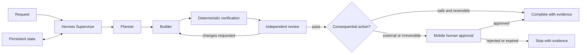
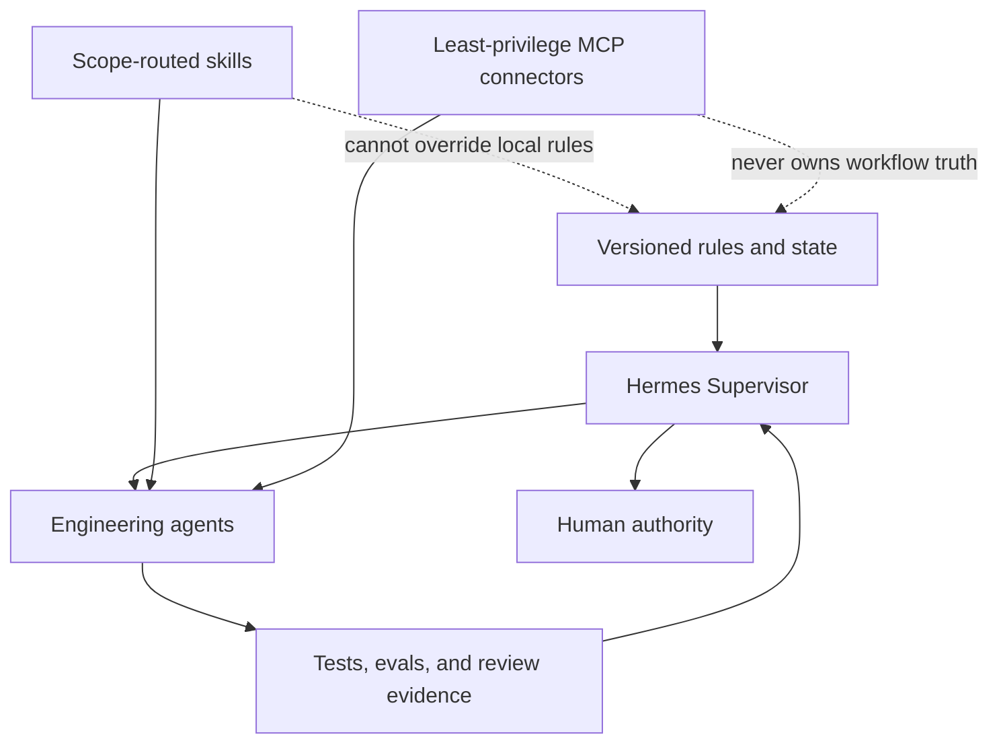

# Architecture

## Autonomous engineering loop

Hermes coordinates state transitions and role hand-offs. It does not replace the
specialized agents, deterministic checks, or human authority.

## Extension boundaries

## Authority model

- Routine and reversible local work may continue autonomously.
- A model may propose a consequential action but cannot grant its own approval.
- A mobile approval is scoped to one exact action, identity, target, and expiry.
- Rejection, expiry, stale state, or changed content results in denial.
- Every completion claim is backed by fresh verification evidence.
